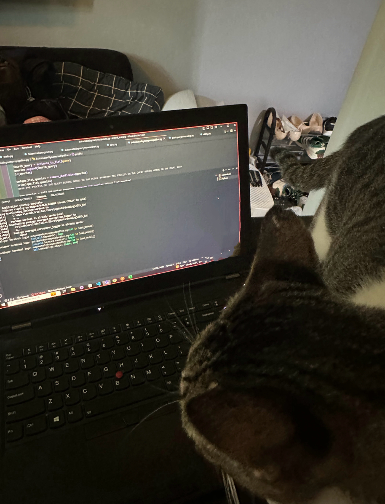

# Hawhaw Cat Stable Diffusion

This project is a personalized Stable Diffusion model trained on photos of my beloved cat, Hawhaw, from when I was living in an apartment. (I miss him.)

## Data

The training data consists of a collection of photos of Hawhaw taken during our time living in the apartment. These photos capture various poses, expressions, and moments of Hawhaw's life.

## Model

For this project, I used the SSD-1B model (resources provided below) due to its distilled nature, which potentially leads to lower GPU consumption and faster inference. Additionally, I tried a different VAE (madebyollin/sdxl-vae-fp16-fix) for the same reasons of faster runtime and lower memory consumption.

## Approach

Initially, the approach was supposed to be a plain Stable Diffusion fine-tuning. However, considering the recent emerging methods available in Large Language Models (LLMs), I assumed Stable Diffusion has similar capabilities.

1. **DreamBooth**: Originated from a research paper in 2023, DreamBooth introduced a method to personalize text-to-image models using just a few (three to five) sample images.
    1. small note here I think I didn’t manage to utilize dreambooth to its full potential due to I didn’t play around the prior_preservation, which probably one of the selling points of dreambooth.
    
2. **LORA (Low-Rank Adaptation)**: With LORA, we only update the adapter, which has a small percentage of parameters compared to the base model. This allows for faster training and can be done with smaller GPUs. 

## Implementation

I utilized various resources, such as examples from the diffusers library. However, I discovered that a significant portion of the code was blackbox and potentially unnecessary (for now). In an attempt to make the code more lightweight, I recreated the code in a Jupyter Notebook.

Please note that I used an older version of some libraries due to encountering challenging errors in the newer versions, especially in the diffusion library where some issues and pull requests remain unresolved (see the error details below).

## Results

The generated images of Hawhaw turned out quite decent given the data is not really up to par with the examples used in hugging face in terms of quality and using a distilled version of SD and VAE. In the anime output, I think the results could have been even better if I had used an anime-based model specifically designed for this purpose, such as the gyoza/flad-2d animerge model

## Errors Encountered

Currently using a slightly version of the libraries due to some error below

[Exception training model: 'cannot import name 'text_encoder_lora_state_dict' from 'diffusers.loaders'](https://www.reddit.com/r/DreamBooth/comments/187llaj/exception_training_model_cannot_import_name_text/)

[https://github.com/huggingface/diffusers/issues/4649](https://github.com/huggingface/diffusers/issues/4649)

[mat1 and mat2 shapes cannot be multiplied](https://www.reddit.com/r/StableDiffusion/comments/11m57w1/mat1_and_mat2_shapes_cannot_be_multiplied/)

[https://github.com/huggingface/diffusers/issues/5133](https://github.com/huggingface/diffusers/issues/5133)

[https://github.com/huggingface/diffusers/issues?q=is%3Aissue+is%3Aopen+0.28.0.dev0](https://github.com/huggingface/diffusers/issues?q=is%3Aissue+is%3Aopen+0.28.0.dev0)

Also newer version of diffuser in SDXL pipeline even with smaller models like SSD-1B, 8bit optimizers and fp16 precision (tested with Nvidia L4/T4) for some reason still experiencing OOM.

## Resources

[Stable Diffusion text-to-image fine-tuning](https://huggingface.co/docs/diffusers/v0.13.0/en/training/text2image)

[Using LoRA for Efficient Stable Diffusion Fine-Tuning](https://huggingface.co/blog/lora)

[DreamBooth fine-tuning with LoRA](https://huggingface.co/docs/peft/main/en/task_guides/dreambooth_lora)

[DreamBooth](https://huggingface.co/docs/diffusers/training/dreambooth)

[SSD-1B Free Serverless API](https://www.segmind.com/models/ssd-1b)

[SSD-1B: Segmind Stable Diffusion Model That Changes Everything](https://anakin.ai/blog/ssd-1b/)
